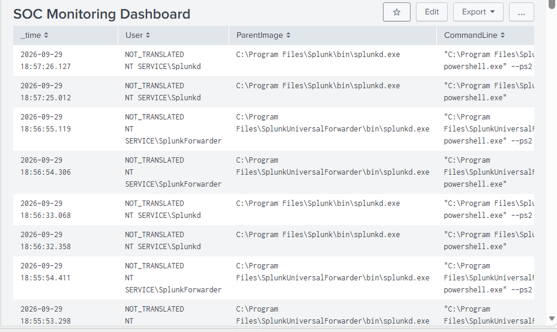
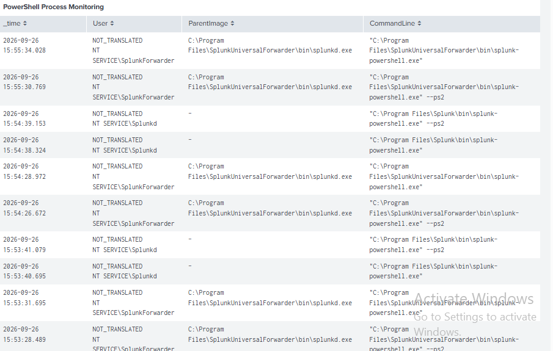
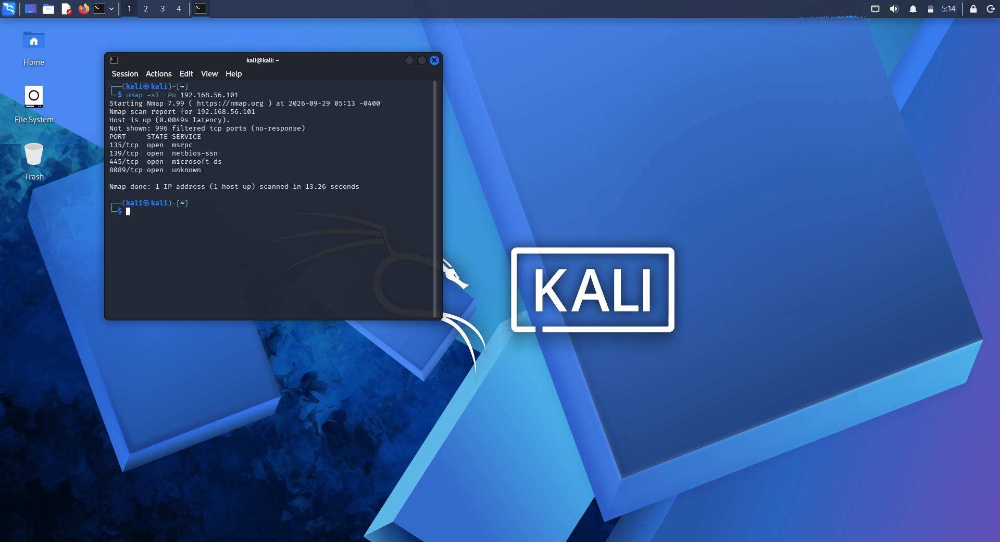
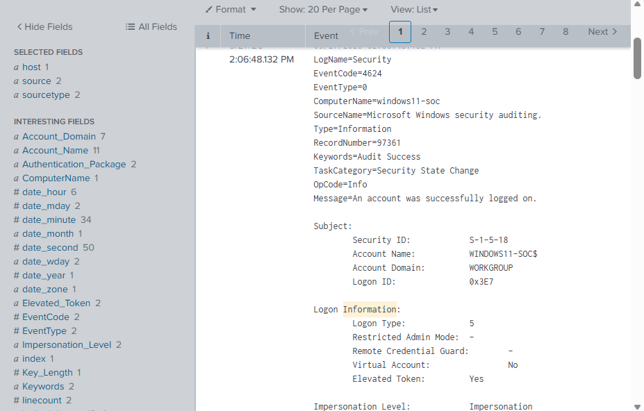

# Home SOC Monitoring Lab with Splunk

A hands-on cybersecurity lab designed to simulate a **Security Operations Center (SOC)** environment using **Splunk Enterprise** for centralized security monitoring, Windows event analysis, Sysmon telemetry, detection engineering, security investigation, and dashboard-based visualization.

## Architecture

```text
Kali Linux VM
      ↓
Controlled Security Testing
      ↓
Windows 11 VM
      ↓
Sysmon + Windows Security Logs
      ↓
Splunk Universal Forwarder
      ↓
Splunk Enterprise
      ↓
SOC Monitoring Dashboard
      ↓
Security Investigation
```

## Technologies

* Windows 11
* Splunk Enterprise 10.4.0
* Splunk Universal Forwarder
* Sysmon
* Kali Linux
* VirtualBox
* SPL
* Windows Event Logs
* MITRE ATT&CK

## Key Features

* Centralized Windows security event monitoring
* Sysmon-based process telemetry collection
* PowerShell activity detection
* Windows command-line activity detection
* Successful and failed authentication monitoring
* Process creation analysis
* Windows Event ID analysis
* Network reconnaissance analysis
* SMB enumeration analysis
* SMB protocol analysis
* SPL-based security detection and investigation
* SOC dashboard development
* MITRE ATT&CK technique mapping
* Structured security investigation workflow

---

## Splunk Analysis Queries

The following **Splunk Search Processing Language (SPL)** queries were developed to support security monitoring, detection analysis, event investigation, and SOC dashboard visualization.

### 1. PowerShell Process Monitoring

```spl
index=main sourcetype=XmlWinEventLog:Microsoft-Windows-Sysmon/Operational EventCode=1
| search Image="*powershell.exe"
| table _time Computer User Image ParentImage CommandLine
| sort - _time
```

Identifies PowerShell process creation events collected through Sysmon for security monitoring and investigation.

### 2. CMD Process Monitoring

```spl
index=main sourcetype=XmlWinEventLog:Microsoft-Windows-Sysmon/Operational EventCode=1
| search Image="*cmd.exe"
| table _time Computer User Image ParentImage CommandLine
| sort - _time
```

Identifies Windows Command Shell process activity recorded by Sysmon.

### 3. Process Creation Monitoring

```spl
index=main sourcetype=XmlWinEventLog:Microsoft-Windows-Sysmon/Operational EventCode=1
| table _time Computer User Image ParentImage CommandLine
| sort - _time
```

Provides visibility into process creation activity across the monitored Windows endpoint.

### 4. Sysmon EventCode Monitoring

```spl
index=main sourcetype=XmlWinEventLog:Microsoft-Windows-Sysmon/Operational
| stats count by EventCode
| sort - count
```

Summarizes the distribution of Sysmon event types received by Splunk.

### 5. Successful Logon Monitoring

```spl
index=main sourcetype=WinEventLog:Security EventCode=4624
| table _time Account_Name Logon_Type Source_Network_Address Workstation_Name
| sort - _time
```

Provides visibility into successful Windows authentication events represented by Event ID 4624.

### 6. Failed Logon Monitoring

```spl
index=main sourcetype=WinEventLog:Security EventCode=4625
| table _time Account_Name Logon_Type Source_Network_Address Workstation_Name
| sort - _time
```

Identifies failed Windows authentication events represented by Event ID 4625 for subsequent security investigation.

### 7. Windows Filtering Platform Event Investigation

```spl
index=main sourcetype=WinEventLog:Security
| search EventCode=5152 OR EventCode=5157
| table _time EventCode Account_Name Source_Address Source_Port Destination_Address Destination_Port Protocol
| sort - _time
```

Investigates Windows Filtering Platform events associated with network connection activity.

---

## Security Testing

The lab environment was subjected to controlled security testing from the Kali Linux VM against the monitored Windows 11 endpoint.

### Nmap Network Scan

```bash
nmap -sT -Pn 192.168.56.101
```

A controlled Nmap scan was performed to generate network reconnaissance activity for monitoring and security analysis.

The Windows endpoint exposed:

* TCP 135
* TCP 139
* TCP 445
* TCP 5432
* TCP 8000
* TCP 8089

The resulting activity was reviewed using Windows security telemetry and Splunk searches.

### SMB Enumeration

```bash
smbclient -L //192.168.56.101 -N
```

A controlled SMB share enumeration attempt was performed against the Windows endpoint.

The endpoint returned:

```text
NT_STATUS_ACCESS_DENIED
```

The result was retained as part of the security investigation and lab validation.

### SMB Protocol Detection

```bash
nmap -p 445 --script smb-protocols 192.168.56.101
```

The command was used to identify SMB protocol versions supported by the monitored Windows endpoint.

### HTTP Service Testing

```bash
curl -I http://192.168.56.101:8000
```

A controlled HTTP request was generated to validate network activity visibility within the lab environment.

---

## Authentication Testing

Windows authentication telemetry was validated using controlled authentication activity.

### Successful Authentication

```text
4624
```

Event ID 4624 was used to validate the collection and analysis of successful Windows authentication events.

### Failed Authentication

```text
4625
```

A controlled incorrect-password attempt was generated to validate failed authentication event collection.

The test consisted of a single controlled authentication failure and was **not intended to simulate a brute-force attack**.

---

## MITRE ATT&CK Mapping

| Detection Activity            | MITRE ATT&CK Technique                                   | Technique ID |
| ----------------------------- | -------------------------------------------------------- | ------------ |
| PowerShell activity           | Command and Scripting Interpreter: PowerShell            | T1059.001    |
| Windows command-line activity | Command and Scripting Interpreter: Windows Command Shell | T1059.003    |
| Nmap network scanning         | Network Service Scanning                                 | T1046        |
| SMB enumeration               | Network Share Discovery                                  | T1135        |

The mapped activities demonstrate how selected security monitoring and controlled testing scenarios can be aligned with relevant MITRE ATT&CK techniques.

Authentication events are monitored for security investigation; however, Event IDs 4624 and 4625 alone are not mapped to **Valid Accounts (T1078)** because the available evidence does not establish use of compromised or otherwise valid credentials as an adversary technique.

---

## Incident Investigation Workflow

```text
Security Activity
       ↓
Windows / Sysmon Telemetry
       ↓
Splunk Log Collection
       ↓
Detection Query
       ↓
Security Investigation
       ↓
Activity Validation
       ↓
Finding Documentation
```

## Project Flow

```text
Kali Linux
     ↓
Controlled Security Testing
     ↓
Windows 11
     ↓
Sysmon / Windows Security Logs
     ↓
Splunk Universal Forwarder
     ↓
Splunk Enterprise
     ↓
SPL Detection Queries
     ↓
SOC Monitoring Dashboard
     ↓
Security Analysis
```

---

## SOC Dashboard

The SOC dashboard provides **centralized visibility** into security telemetry collected from the monitored Windows endpoint.

It supports **centralized monitoring**, security event analysis, investigation, and visualization through Splunk.



## Detection Screenshots

### PowerShell Detection


### Failed Logon Detection


### Nmap Scan Detection


### SMB Enumeration


### Sysmon Process Creation


### Successful Logon Detection


---

## Detection and Alerting

Splunk serves as the centralized platform for collecting, searching, analyzing, and investigating Windows and Sysmon security telemetry.

Detection searches were developed for:

* PowerShell process activity
* Windows Command Shell activity
* Process creation
* Successful authentication
* Failed authentication
* Sysmon event activity
* Network security activity

The current implementation focuses on **detection searches, security investigation, and SOC dashboard monitoring**.

Automated Splunk alert notifications are **not enabled in the current Splunk Free license environment**.

---

## Lab Environment

The project was developed and validated within an isolated VirtualBox-based virtual lab.

### Lab Architecture

```text
Kali Linux VM
      │
      │ Controlled Security Testing
      ↓
Windows 11 VM
├── Sysmon
├── Windows Security Logs
├── Splunk Universal Forwarder
└── Splunk Enterprise
        │
        ↓
   SOC Dashboard
```

### Windows Endpoint

```text
IP Address: 192.168.56.101
```

The Windows 11 VM served as the monitored endpoint and Splunk Enterprise host.

### Security Testing Host

The Kali Linux VM was used to generate controlled security activity, including:

* Nmap network scanning
* SMB enumeration
* SMB protocol analysis
* HTTP service testing

---

## Project Structure

```text
SOC-Monitoring-with-Splunk/
│
├── README.md
│
├── Config/
│   ├── Splunk-Configuration.md
│   ├── Sysmon-Configuration.md
│   └── Windows-Event-Log-Configuration.md
│
├── Dashboard/
│   └── Dashboard-Documentation.md
│
├── Documentation/
│   ├── Architecture.md
│   ├── Attack-Simulation.md
│   ├── Detection-Rules.md
│   ├── Incident-Response.md
│   ├── MITRE-ATTACK-Mapping.md
│   ├── Project-Overview.md
│   └── Project-Walkthrough.md
│
├── Queries/
│   └── Detection-Queries.md
│
└── Screenshot/
    ├── failed-logon/
    │   └── failed-logon-detection.png
    │
    ├── nmap-scan/
    │   └── nmap-scan-detection.png
    │
    ├── powershell-detection/
    │   └── powershell-command-detection.png
    │
    ├── smb-enumeration/
    │   └── smb-enumeration-detection.png
    │
    ├── soc-dashboard/
    │   ├── soc-dashboard-overview.png
    │   └── soc-dashboard-alerts.png
    │
    ├── successful-logon/
    │   └── successful-logon-detection.png
    │
    └── sysmon-events/
        └── sysmon-process-creation.png
```

---

## Skills Demonstrated

* Security Operations Center (SOC) Monitoring
* Security Information and Event Management (SIEM)
* Splunk Enterprise
* Splunk Universal Forwarder
* Sysmon
* SPL Query Development
* Windows Event Log Analysis
* Security Event Investigation
* Process Monitoring
* Authentication Monitoring
* Network Security Monitoring
* Nmap Reconnaissance Analysis
* SMB Enumeration Analysis
* MITRE ATT&CK Mapping
* SOC Dashboard Development
* Incident Investigation

---

## Limitations

* The project was developed and validated within a controlled virtual lab environment.
* Detection coverage depends on the configured Windows and Sysmon telemetry sources.
* Individual security events require contextual analysis before being classified as malicious or benign.
* Legitimate administrative or system activity may generate events requiring additional validation.
* Automated Splunk alert notifications are not enabled in the current Splunk Free license environment.
* The implementation does not represent a production-scale SOC deployment.

---

## Future Improvements

* Expand Sysmon-based detection coverage.
* Integrate additional Windows security telemetry.
* Develop correlation searches for related security events.
* Implement automated alert notifications when supported by the SIEM environment.
* Integrate threat intelligence feeds.
* Expand MITRE ATT&CK technique coverage.
* Develop additional SOC investigation dashboards.
* Implement automated incident-response workflows.
* Correlate endpoint and network telemetry.

---

## Project Outcome

This project provided practical experience in **SOC monitoring, SIEM implementation, Windows security telemetry analysis, Sysmon-based detection, SPL development, network reconnaissance analysis, authentication monitoring, MITRE ATT&CK mapping, and security investigation**.

The lab demonstrates an end-to-end security monitoring workflow in which endpoint telemetry is collected through Splunk, analyzed using SPL-based detection searches, investigated within the SIEM, and presented through a centralized SOC dashboard for investigation.
